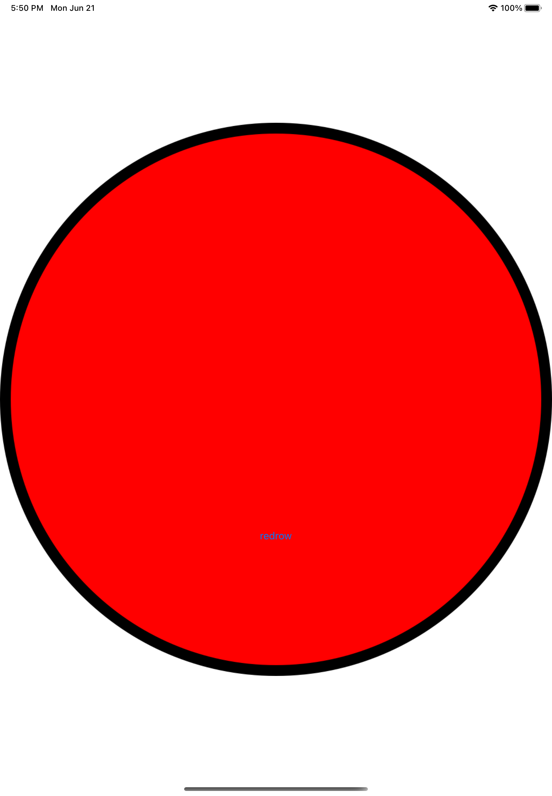
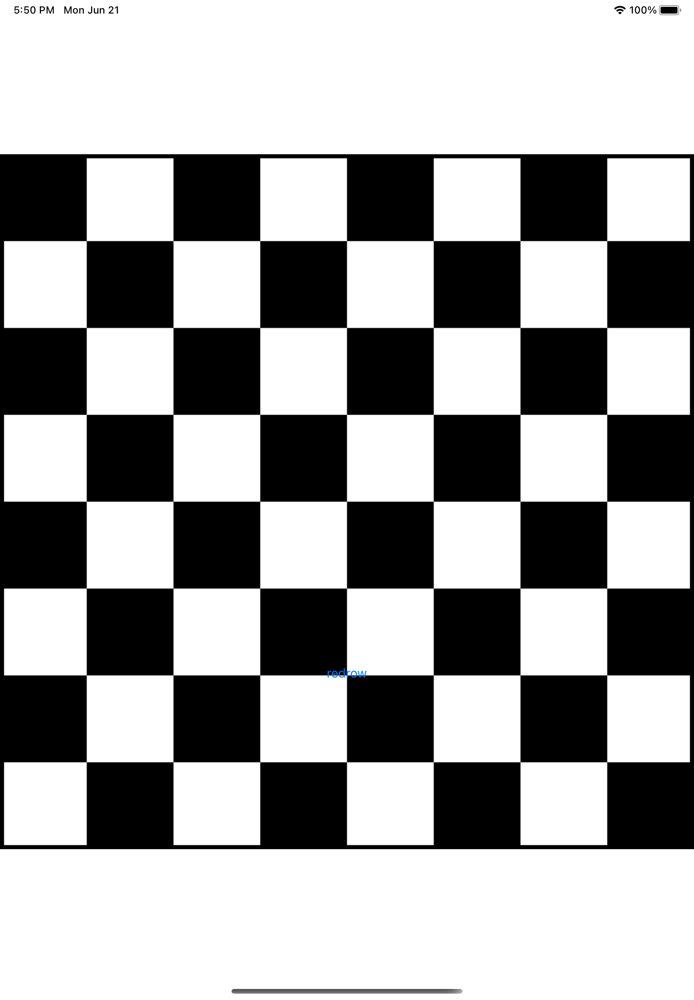
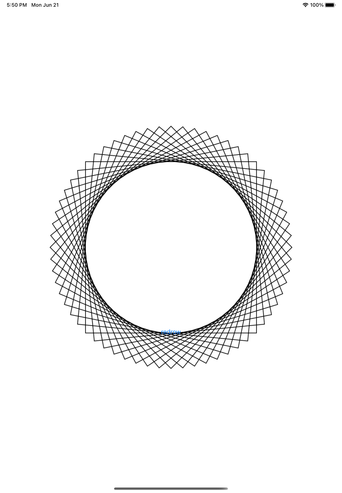
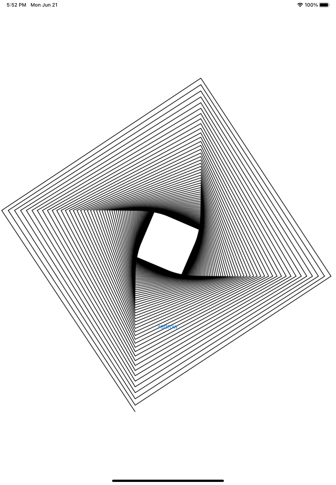

# PressForDrowing
Show new drowing by tapping on the button 
## Tools implemented in project
- UIGraphicsImageRenderer
- .image()
- .pngData()
- .jpegData()
- setFillColor()
- setLineWidth()
- drawPath()
- context.cgContext
- UIBezierPath
- .translate(by:)
- .rotate()
 ## Project Screen Shots

## More features soon 
- drawing clocks
- drowing cards
## Conclusion 
It was an interesting project which helped me to understand how works drawing in swift.  
Even though it was a basic app, it was challenging for me and takes lots of efforts to finish.
I'm satisfied with the work I've done and will return to make this up even more beautiful.

